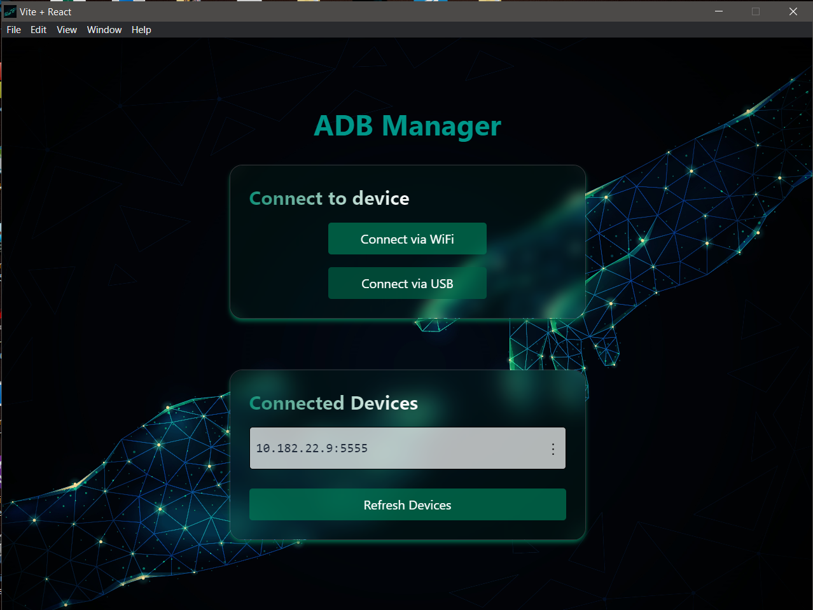

# ADB Connect

ADB Connect is a modern Electron + React desktop application for managing Android devices via ADB (Android Debug Bridge). It provides a beautiful, glassmorphism-inspired UI for connecting, exploring, and managing your devices over WiFi or USB.

## Features

- **Connect to Android devices** via WiFi or USB
- **List connected devices** with live status
- **Execute shell commands** on any device
- **File Explorer**: Browse device files/folders, download files to PC
- **Send files** to device storage
- **Reconnect devices** with one click
- **Modern UI** with glassmorphism and smooth transitions

## Screenshots

![Main UI]

## Getting Started

### Prerequisites

- [Node.js](https://nodejs.org/) (v18+ recommended)
- [ADB](https://developer.android.com/tools/adb) installed and available in your system PATH

### Installation

1. **Clone the repository:**
   ```sh
   git https://github.com/IllangasingheIMDP/Connect.git
   cd connect
   ```
2. **Install dependencies:**
   ```sh
   npm install
   cd frontend/src
   npm install
   cd .. && cd ..
   ```
3. **Run the application:**
   ```sh
   npm start
   ```

## Usage

1. Connect your Android device to your computer via USB or ensure it's on the same WiFi network.
2. Enable **USB Debugging** on your Android device.
3. Launch ADB Connect.
4. Your device should appear in the list. If not, click on **Refresh**.
5. To connect via WiFi, note the IP address displayed and connect using `adb connect <IP_ADDRESS>` in the terminal.
6. Explore and manage your device using the intuitive UI.

## Troubleshooting

- Ensure ADB is properly installed and recognized in your terminal/command prompt.
- If devices don't show up, try restarting the ADB server with `adb kill-server` followed by `adb start-server`.
- For USB connections, ensure your device is unlocked and the screen is on.
- Check [ADB documentation](https://developer.android.com/studio/command-line/adb) for more ADB-related troubleshooting tips.

## Contributing

Contributions are welcome! Please follow these steps:

1. Fork the repository.
2. Create a new branch: `git checkout -b feature/YourFeature`
3. Make your changes.
4. Test your changes.
5. Commit your changes: `git commit -m 'Add some feature'`
6. Push to the branch: `git push origin feature/YourFeature`
7. Submit a pull request.

Please ensure your code adheres to the existing style and conventions used in the project.

## License

This project is licensed under the MIT License - see the [LICENSE](LICENSE) file for details.

---

ADB Connect is maintained with ❤️ by [I.M.D.P.Illangasinghe](https://github.com/IllangasingheIMDP).

